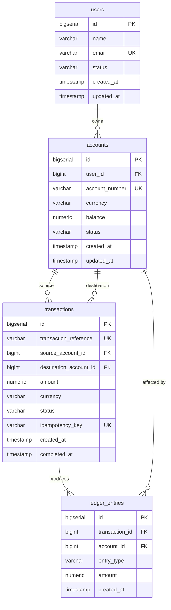

# ClearLedger

A production-oriented financial ledger and reconciliation platform demonstrating
correct implementation of double-entry accounting, ACID transactions, pessimistic
concurrency control, and robust idempotency in a Spring Boot monolith.

---

## Overview

ClearLedger solves the problem of reliable financial transfer tracking:

- Every transfer produces immutable, balanced ledger entries.
- No race condition can produce a negative balance.
- Duplicate transfer requests are detected and handled safely.
- The system never commits partial financial state.
- Rollback integrity is strictly preserved: failed attempts leave zero orphaned or pending records.

---

## Architecture

Phase 1 is a **layered modular monolith**:

```
controller/   HTTP request handling, validation, response mapping
service/      Business logic (AccountService, TransactionService)
repository/   Spring Data JPA (UserRepository, AccountRepository, TransactionRepository, LedgerEntryRepository)
domain/       Entities (User, Account, Transaction, LedgerEntry) + enums
dto/          Request/response records
mapper/       Entity → DTO conversion
exception/    Domain exceptions + GlobalExceptionHandler
config/       Spring configuration (OpenAPI, JPA, TransactionTemplate)
util/         Money (BigDecimal arithmetic)
```

---

## Core Financial Model: Double-Entry Accounting

Every completed transfer creates exactly **two ledger entries**:

```
DEBIT   source_account   amount
CREDIT  destination_account   amount
```

The invariant is enforced after every transfer:

```
SUM(DEBIT ledger entries) == SUM(CREDIT ledger entries)
```

If the invariant fails, the entire transaction is rolled back.

**Money representation**: All monetary values use `BigDecimal` with scale=2 and
`RoundingMode.HALF_EVEN`. `float`/`double` are never used for monetary arithmetic.

---

## Transaction Lifecycle

```
POST /api/v1/transactions
        │
        ▼
1. Fast-path Idempotency Check (returns existing COMPLETED tx if already processed)
        │
        ▼
2. Enter @Transactional executeTransfer boundary
        │
        ▼
3. Acquire Pessimistic Write Locks (SELECT FOR UPDATE) on accounts ordered by ID (min, then max)
        │
        ▼
4. Double-Checked Idempotency Lookup inside lock (handles concurrent duplicate requests)
        │
        ▼
5. Validate: Active accounts, matching currency, balance >= amount, source != destination
        │
        ▼
6. Mutate Balances: source.debit(amount), destination.credit(amount)
        │
        ▼
7. Persist Transaction (COMPLETED) + Balanced Ledger Entries (DEBIT & CREDIT)
        │
        ▼
8. Verify Ledger Invariant (SUM debits == SUM credits, count == 2)
        │
        ▼
COMMIT (or complete ROLLBACK on any failure — zero partial state)
```

---

## Idempotency Design

The client provides an `idempotencyKey` (UUID recommended) with each transfer request.

- **First request**: Transaction is created and processed atomically (status = COMPLETED).
- **Sequential repeat request (same payload)**: Fast-path returns the existing COMPLETED transaction without acquiring locks or re-executing transfers.
- **Sequential repeat request (different payload)**: Rejected with `IDEMPOTENCY_CONFLICT` (HTTP 409).
- **Concurrent identical requests**:
  - Both requests attempt to lock the same accounts in ascending ID order.
  - Request 1 acquires the lock, completes the transfer, persists the COMPLETED transaction and ledger entries, and commits.
  - Request 2 acquires the lock after Request 1 commits, finds the completed transaction via the double-checked lookup inside the lock, verifies payload, and returns the result without debiting again.
- **Concurrent requests with differing accounts**:
  - The PostgreSQL `uq_transactions_idempotency` unique constraint enforces global uniqueness.
  - The winning request commits; the losing request rolls back cleanly.
  - The outer recovery boundary catches the constraint violation and reloads the winning transaction safely outside the rolled-back boundary.

---

## Concurrency Strategy: Pessimistic Locking

**Why pessimistic locking?**

A financial transfer requires:
1. Read balance.
2. Check balance ≥ amount.
3. Debit balance.

Without locking, two concurrent transfers from the same account can both read the initial balance, both pass the check, and both debit — producing a negative balance.

**Pessimistic locking** (`SELECT ... FOR UPDATE`) serializes access at the account level during balance mutation.

**Deadlock prevention**: Accounts are always locked in ascending ID order (`min(S, D)`, `max(S, D)`). If transfer A touches accounts (1, 2) and transfer B touches accounts (2, 1), both lock account 1 first, eliminating cyclical wait deadlocks.

---

## Database Schema



---

## API Endpoints

| Method | Path | Description |
|--------|------|-------------|
| `POST` | `/api/v1/accounts` | Create account (creates/finds user by email) |
| `GET`  | `/api/v1/accounts/{id}` | Get account details |
| `GET`  | `/api/v1/accounts/{id}/balance` | Get current balance |
| `GET`  | `/api/v1/accounts/{id}/transactions` | Paginated transaction history |
| `POST` | `/api/v1/transactions` | Execute an idempotent transfer |

Swagger UI: http://localhost:8080/swagger-ui.html
OpenAPI JSON: http://localhost:8080/api-docs

---

## Running Locally

### Prerequisites
- Java 21
- Maven 3.9+
- Docker + Docker Compose

### Start PostgreSQL

```bash
docker compose up -d
```

### Run the application

```bash
mvn spring-boot:run
```

Flyway will run `V1__init.sql` automatically on first start.

### Run all tests

```bash
mvn clean verify
```

Testcontainers spins up a PostgreSQL container for integration tests automatically.
No manual DB setup required for tests.

### Example: Create account

```bash
curl -X POST http://localhost:8080/api/v1/accounts \
  -H "Content-Type: application/json" \
  -d '{"name":"Kopal Khare","email":"kopal@example.com","currency":"INR"}'
```

### Example: Transfer

```bash
curl -X POST http://localhost:8080/api/v1/transactions \
  -H "Content-Type: application/json" \
  -d '{
    "sourceAccountId": 1,
    "destinationAccountId": 2,
    "amount": 1000.00,
    "currency": "INR",
    "idempotencyKey": "unique-client-key-001"
  }'
```

---

## Testing

| Category | Tests | Description |
|----------|-------|-------------|
| Unit | `MoneyTest` | Scale=2, HALF_EVEN rounding, exact comparison |
| Unit | `AccountTest` | Balance manipulation, debit/credit invariants |
| Integration | `AccountIntegrationTest` | Account creation, user deduplication, multi-currency wallets |
| Integration | `TransactionIntegrationTest` | Valid transfers, balance checks, currency validation, idempotency conflicts |
| Concurrency | `ConcurrencyIntegrationTest` | Concurrent spending, 10-thread identical idempotency race, rollback atomicity, clean retries |

All integration tests use **Testcontainers PostgreSQL** with automated Flyway migrations.

---

## Engineering Decisions

| Decision | Rationale |
|----------|-----------|
| Layered modular monolith | Clear separation of concerns; simplifies transactions and debugging in Phase 1 |
| Pessimistic locking | Prevents race conditions and lost-update anomalies during concurrent transfers |
| Deterministic lock ordering | Ascending account ID ordering eliminates deadlocks |
| Double-checked idempotency | Serializes concurrent duplicates cleanly without throwing constraint violations |
| Outer recovery boundary | Catches unexpected unique constraint races outside the transaction boundary to avoid Spring rollback-only exceptions |
| `BigDecimal` exclusively | Avoids IEEE 754 floating-point inaccuracies |
| `HALF_EVEN` rounding | Banker's rounding reduces cumulative rounding drift across high transaction volumes |
| DB CHECK constraints | Defense in depth: `balance >= 0`, `amount > 0`, `status IN (...)` enforced at database layer |
| No password_hash in Phase 1 | Authentication deferred to Phase 2 to keep Phase 1 focused strictly on ledger correctness |
